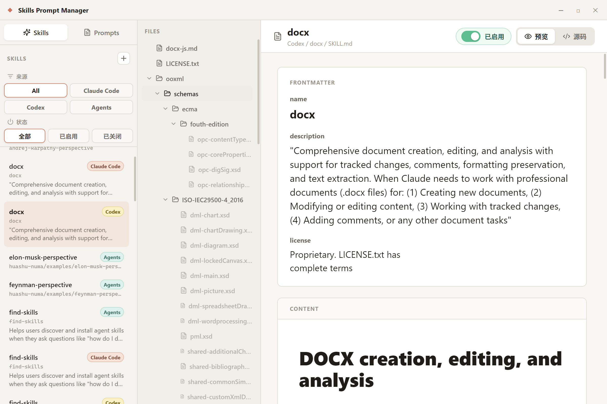

<div align="center">

# 🗂️ Skills Prompt Manager

### 你的 AI Skill 与 Prompt 统一工作台

**一个地方，管好散落在 Claude、Codex、Agents 里的所有 skill 包和可复用 prompt。**
浏览、编辑、预览、一键复制——本地优先，所见即所得。

[English](README_EN.md) · 中文

[](#-安装)
[](#-技术栈)
[](#-技术栈)
[](LICENSE)


<sub>👆 建议替换为一张完整主界面截图（左侧 skill 索引树 + 右侧预览面板），最能一眼说明产品。</sub>

</div>

---

## 为什么需要它？

当你同时在 **Claude、Codex、Agents** 上写 skill，目录散落在三处：`~/.claude/skills`、`~/.codex/skills`、`~/.agents/skills`。重名的 skill 分不清来源，改一个 `SKILL.md` 要在文件管理器和编辑器之间反复横跳，想复制一段 prompt 还得手动剔掉 YAML frontmatter。

**Skills Prompt Manager 把这一切收进一个干净的桌面工作台**——专为 skill 作者和 prompt 工程师打造，让你专注于内容，而不是找文件。

## ✨ 核心特性

- 🔍 **多源统一索引** —— 自动扫描 `~/.claude/skills`、`~/.codex/skills`、`~/.agents/skills`，所有 skill 一屏尽收。
- 🏷️ **来源一目了然** —— 重名 skill 用 Claude / Codex / Agents 徽章区分，再也不会改错平台。
- 📝 **文件树内编辑** —— `SKILL.md`、引用文档、脚本、JSON、CSS 等文本资产，全部在一个界面打开即改。
- 👁️ **结构化预览** —— Markdown 自动拆分 frontmatter 与正文分区展示；代码文件带语法高亮，读起来像文档而非源码。
- 📋 **纯净 Prompt 复制** —— 一键复制 prompt 正文，自动剔除 YAML frontmatter，粘贴即用。
- 💻 **本地优先** —— 通过 Electron IPC 直接读写本地文件，不上传、不联网、数据始终在你机器上。

## 📸 界面预览

| 功能 | 截图 |
| --- | --- |
| Skill 管理主界面 | `docs/images/skipro.png` |
| Prompt 编辑视图 | `docs/images/skipro2.png` |
| Skill 浏览器 | `docs/images/skills-browser.png` |
| 代码语法高亮预览 | `docs/images/code-preview.png` |
| Prompt 一键复制 | `docs/images/prompt-copy.png` |

> 💡 宣发建议：录一段 10–15 秒的 GIF（打开 skill → 编辑 → 预览 → 复制 prompt），放在最顶部 Hero 区，转化率远高于静态图。

## 🚀 安装

从最新的 [GitHub Release](../../releases) 下载 Windows 安装包，双击即装。

> ⚠️ 首个 Windows 构建未签名，SmartScreen 可能弹出提醒——点击「更多信息 → 仍要运行」即可。后续接入代码签名证书后该提示会消失。

## 🧩 支持的内容

**Skills** —— 递归查找以下目录下的 `SKILL.md`：

- `~/.claude/skills`
- `~/.codex/skills`
- `~/.agents/skills`

**Prompts** —— 读取 `~/.claude/prompts` 下的 Markdown 文件。

Markdown 以结构化文档渲染并独立展示 frontmatter 面板；`.py`、`.json`、`.js`、`.jsx`、`.ts`、`.tsx`、`.css`、`.html`、`.yaml`、`.toml` 等常见源码文件带语法高亮显示。

## 🛠️ 开发

```bash
npm install      # 安装依赖
npm run dev      # 本地开发
npm run build    # 构建渲染层
npm run dist     # 打包桌面安装程序
```

## 🧱 技术栈

`Electron` · `React` · `Vite` · `React Markdown` · `React Syntax Highlighter` · `Lucide icons`

## 🗺️ Roadmap

- [ ] macOS / Linux 构建
- [ ] 代码签名，消除 SmartScreen 提醒
- [ ] Skill 全文搜索
- [ ] 暗色主题

## 🤝 贡献

欢迎 Issue 与 PR。如果这个工具帮你省了时间，点个 ⭐ 是最好的鼓励。

## 📄 License

[MIT](LICENSE)
