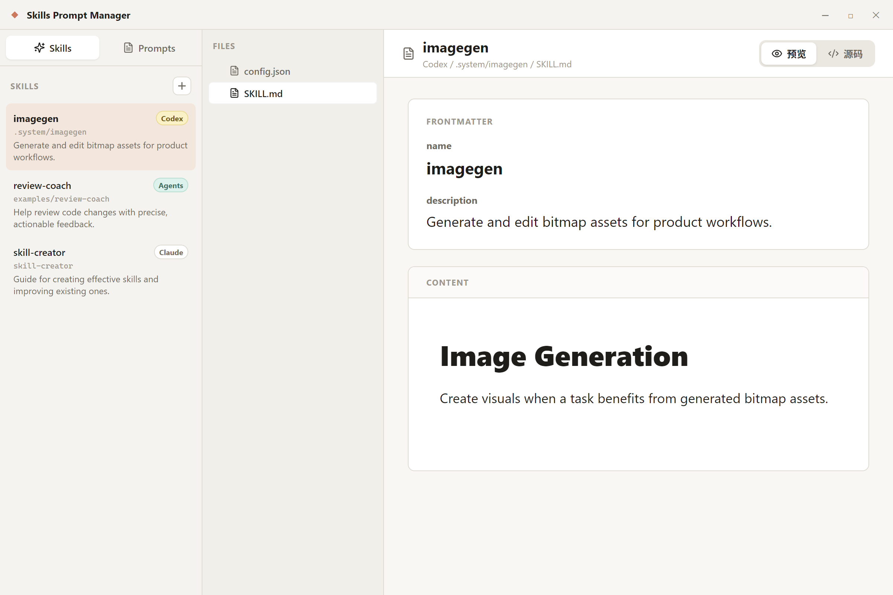
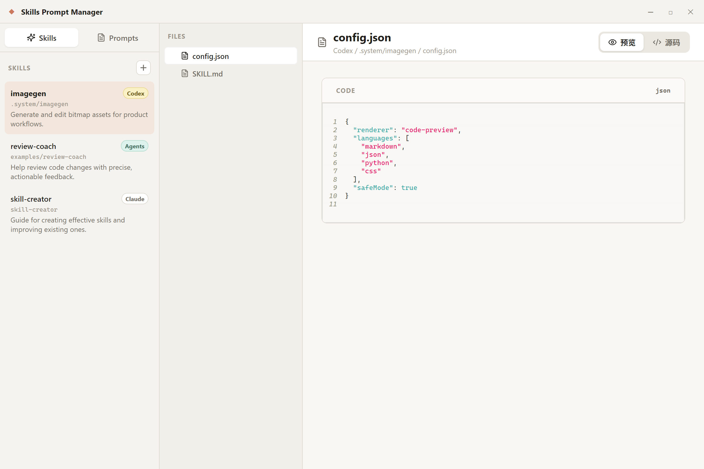
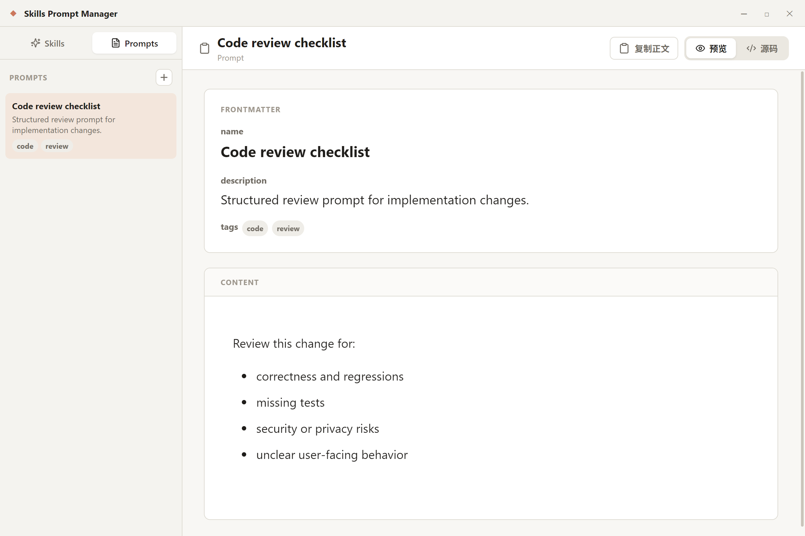

# Skills Prompt Manager

[中文](README.zh-CN.md)



Skills Prompt Manager is a focused desktop app for managing AI skill packages and reusable prompts. It gives skill authors a clean workspace for browsing bundled files, editing `SKILL.md`, previewing Markdown instructions, reviewing code assets, and copying prompt bodies without frontmatter noise.

## Highlights

- **Multi-source skill index**: scans `~/.claude/skills`, `~/.codex/skills`, and `~/.agents/skills`.
- **Source-aware browsing**: duplicate skill names stay distinct with Claude, Codex, and Agents badges.
- **File tree editing**: open and edit `SKILL.md`, references, scripts, JSON, CSS, and other text assets from one place.
- **Readable previews**: Markdown files show frontmatter and body separately; code files render with syntax highlighting.
- **Prompt clipboard flow**: copy only the prompt body, excluding YAML frontmatter.
- **Local-first storage**: the app reads and writes local files directly through Electron IPC.

## Screenshots






## Supported Content

Skills are discovered by recursively finding `SKILL.md` files under:

- `~/.claude/skills`
- `~/.codex/skills`
- `~/.agents/skills`

Prompts are stored as Markdown files under:

- `~/.claude/prompts`

Markdown files are rendered as structured documents with a dedicated frontmatter panel. Common source files such as `.py`, `.json`, `.js`, `.jsx`, `.ts`, `.tsx`, `.css`, `.html`, `.yaml`, `.toml`, `.sh`, and `.ps1` are rendered in a code preview.

## Install

Download the Windows installer from the latest GitHub Release.

The first Windows build is unsigned. Windows may show a SmartScreen warning until the project uses a code-signing certificate.

## Development

```bash
npm install
npm run dev
```

Build the renderer:

```bash
npm run build
```

Build the desktop installer:

```bash
npm run dist
```

## Tech Stack

- Electron
- React
- Vite
- React Markdown
- React Syntax Highlighter
- Lucide icons
